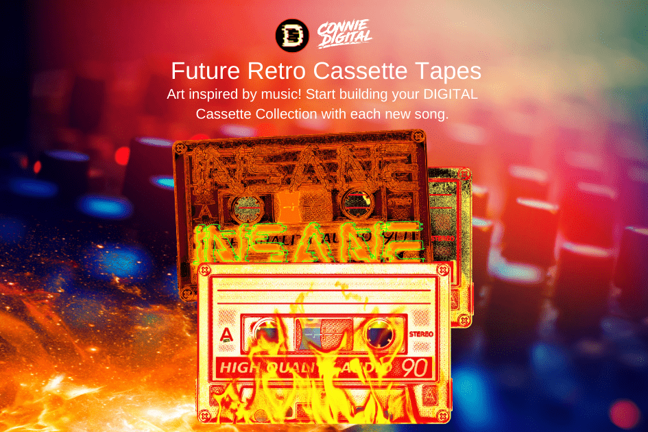

受音乐启发的艺术！随着每首新歌的发布，开始构建您的 DIGITAL Cassette Collection。数字收藏品是虚拟物品的独特或限量版副本。通常有视觉元素，例如数字艺术、视频剪辑或数字交易卡。从理论上讲，它可以是任何用 1 和 0 表示的东西，例如数字音乐录音。收藏品市场在 2020 年出现爆炸式增长，因为许多人在 COVID-19 大流行的深处寻找怀旧或追求新的兴趣。与此同时，加密货币正在成为主流。许多公司试图通过使用[区块链技术](https://www.fool.com/investing/stock-market/market-sectors/financials/blockchain-stocks/what-is-blockchain/)生产数字收藏品来顺应这两种趋势。

