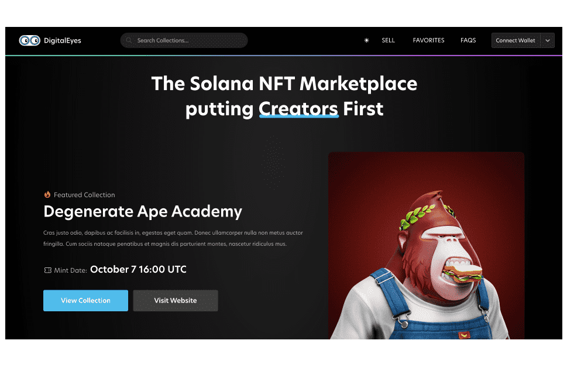

Solana 的第一个开放且无需许可的 NFT 市场！交易任何 NFT，安全有保障！NFT 根据收藏通过我们的创建者门户提交的薄荷哈希列表进行身份验证，而标记为“未验证”的 NFT 属于待验证或未满足我们验证要求的收藏。作为一个开放的市场，DigitalEyes 几乎欢迎所有收藏，并且不认可或策划任何项目，包括在我们的 Launchpad 上列出、验证、营销、广告或发布的项目。不幸的是，虽然几乎每个人都受到欢迎，但也总会有骗子。建议买家始终进行尽职调查——如果看起来好得令人难以置信，那可能就是。

