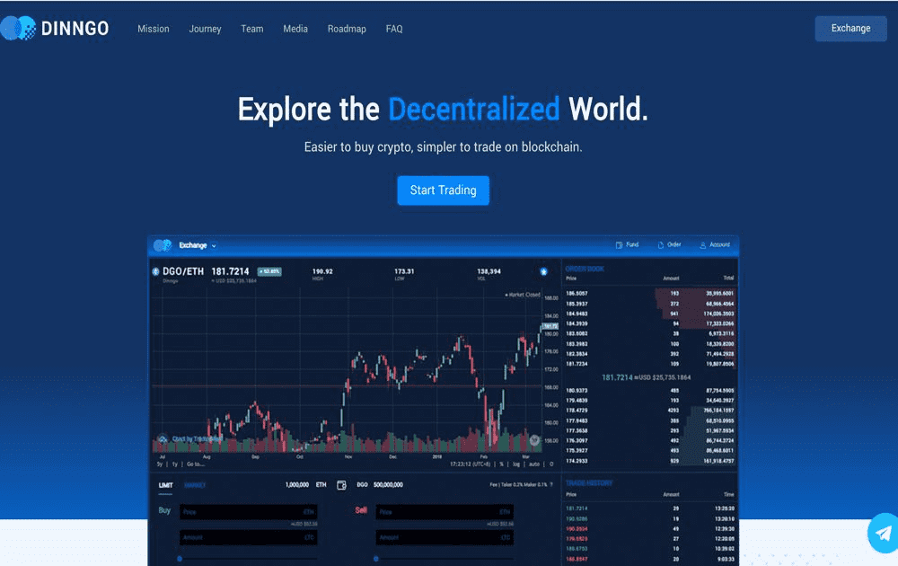

---
title: "DINNGO"
description: "在交易数字货币时，n"
date: 2022-08-16T00:00:00+08:00
lastmod: 2022-08-16T00:00:00+08:00
draft: false
authors: ["boogArno"]
featuredImage: "dinngo.png"
tags: ["Exchanges","DINNGO"]
categories: ["nfts"]
nfts: ["Exchanges"]
blockchain: "ETH"
website: "https://exchange.dinngo.co"
twitter: "https://twitter.com/dinngohq"
discord: ""
telegram: "https://t.me/dinngo"
github: ""
youtube: ""
twitch: ""
facebook: "https://www.facebook.com/dinngohq"
instagram: ""
reddit: ""
medium: "https://medium.com/dinngo-exchange"
steam: ""
gitbook: ""
googleplay: ""
appstore: ""
status: "Live"
weight: 
lightgallery: true
toc: true
pinned: false
recommend: false
recommend1: false
---
交易数字货币时，对安全性的需求始终是重中之重。许多用户浪费了无数时间将离线钱包连接到缓慢且低效的去中心化交易所，只是为了觉得他们的钱是安全的。 DINNGO 消除了麻烦——并将成为市场上第一个在离线（冷）钱包和移动设备之间提供无缝蓝牙集成的交易所。这意味着用户将能够在他们的交易所安全地交易加密货币，并且只需点击一个按钮——无论他们身在何处。

