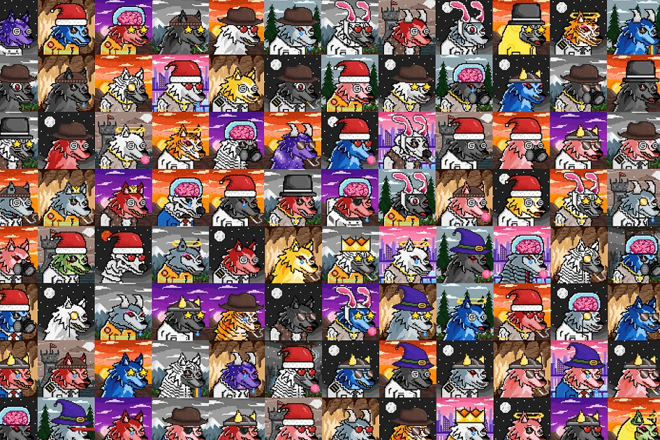

Dire Wolves 是 2000 个随机生成的 NFT 碎片的集合。我们茁壮成长，为我们的持有者带来实用性和价值。加入队伍，探索仅限会员的活动、狼窝、Dire DAO 以及更多即将到来的活动。只有**2,000**只独特的狼将永远存在，每只价格为**0.05 ETH**，可能性是无法理解的，虽然我们所有的狼都是独一无二的，只有 1/1 的部分，其中一小部分比其他的更特别。谁知道呢，可能有一些狼是领头羊。

