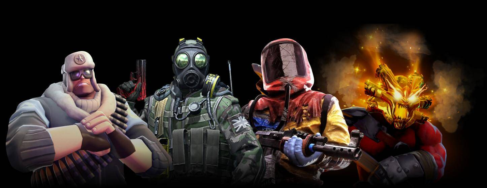

---
title: "Dmarket"
description: "DMarket - NFT 元数据"
date: 2022-08-16T00:00:00+08:00
lastmod: 2022-08-16T00:00:00+08:00
draft: false
authors: ["boogArno"]
featuredImage: "dmarket.png"
tags: ["Collectibles","Dmarket"]
categories: ["nfts"]
nfts: ["Collectibles"]
blockchain: "ETH"
website: "https://dmarket.com/"
twitter: "https://twitter.com/dmarket_com"
discord: ""
telegram: ""
github: ""
youtube: ""
twitch: ""
facebook: "https://www.facebook.com/dmarketcommunity/"
instagram: ""
reddit: ""
medium: ""
steam: ""
gitbook: ""
googleplay: ""
appstore: ""
status: "Live"
weight: 
lightgallery: true
toc: true
pinned: false
recommend: false
recommend1: false
---
DMarket 市场使数百万游戏玩家和电子竞技爱好者能够使用一整套先进的游戏技术和金融科技功能（包括 Target/Bid、Instant Sale 和 DMarket Circular Exchange™）来交易 NFT 和虚拟游戏内物品。DMarket 是一家诞生于乌克兰的初创企业 为世界各地的游戏开发者和玩家开启了数十亿美元的皮肤经济。我们的热情玩家团队相信无国界的游戏世界是一个更好的游戏世界，我们正在构建基础设施，让每个人都能在未来的开放系统中茁壮成长。

