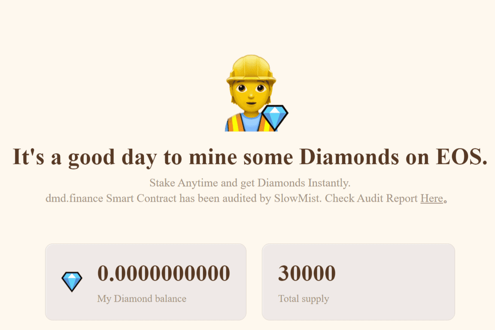

Dmd.finance 是 EOS 上的第一个收益农业，这表明了它对 YFI 的尊重。没有预挖，没有创始人股份，没有VC利益，每个参与者平等。DMD钻石（dmd.finance）是EOS上首个质押挖矿理财机枪池,DMD以YFI的形式发放：没有创始人,没有投资人,没有增发,全民平等。DMD的开发团队EFi旨在完善EOS DeFi生态基础设施,激发整个EOS生态获利,旗下已公开三个产品,分别是理财机枪池DMD,资产跨链eHUB与类Balancer去中心化交易所DolphinSwap。
DMD 是 Dmd.finance 的代币符号，其总供应量为 30,000。并且会分配到不同的矿池中，Diamond 也是 DAO 代币，Dmd.finance 将完全由 Diamond 持有者管理。
您将需要 TokenPocket、MathWallet、MeetOne 或其他 EOS 钱包来挖掘 Diamond。选择您的目标池并单击它，您将看到股权选项。

