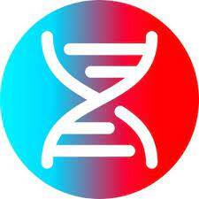

$DNA 算法代币是快速发展的生态系统的支柱，旨在带来流动性。Cronos 上的第一个算法稳定币，通过铸币税与 1 美元的价格挂钩。- 将 DNA LP 分解为 DNA 和 USDC
- 将 DNA 兑换成 DBOND 进行质押
- 将 USDC 换成 DNA 和质押

虽然我们是低于挂钩的，但流动性较低的情况下推高价格要容易得多

“用 DNA 乘以美元”

我们经过实验室测试的算法金融工具将通过创新的 Defi 收益策略帮助您增加您的 DNA 和美元！

