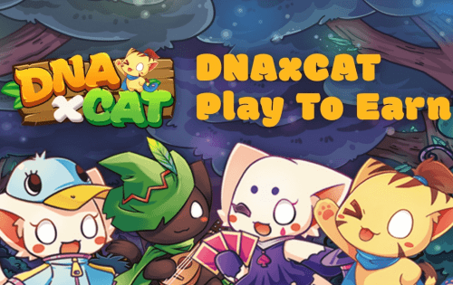

DNAxCAT 是一款基于 BSC（币安智能链）的去中心化游戏。游戏虚拟化了一个基于 DNAxCAT 的数字猫宠物世界。在数字猫宠世界中，玩家可以饲养和繁殖各种可爱的猫咪，并在冒险世界中与自己的猫咪并肩作战。
DNAxCAT 也是一个玩家完全确定所有权的经济体，允许玩家无缝地将他们的游戏资产出售和交易为数字货币。
我们专注于

  令人兴奋的游戏体验和引人入胜的故事情节；
  打造玩家完全决定所有权的经济，引领GameFi（DEFI+NFT）潮流；
  Play To Earn，让玩家通过玩游戏来赚钱。

