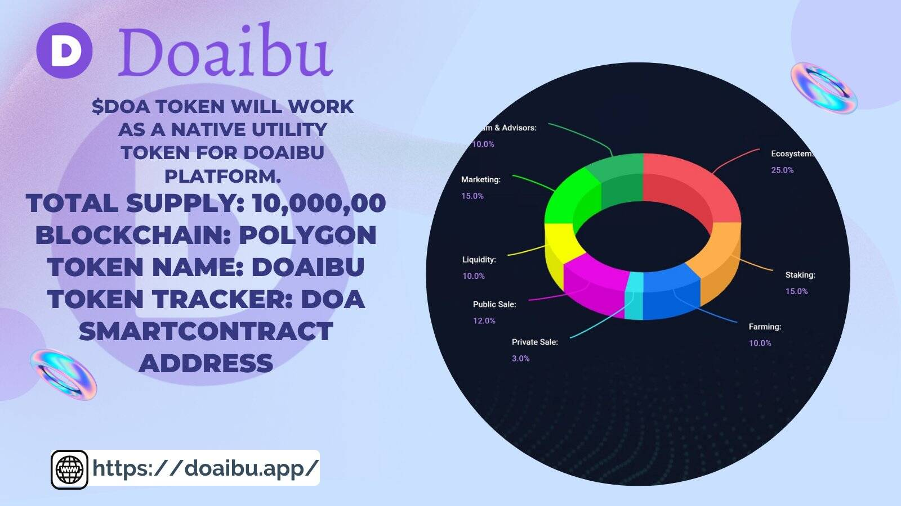

Doaibu 是基于多边形的代币去中心化交换和启动板。 Doaibu 主要使用多边形来连接和构建区块链网络。与市场上的其他代币不同，我们为投资者提供多种服务。我们提供的核心服务包括 Token Swap、Launchpad、Staking & Farming。持续发展、透明度、创造性、盈利能力和社区是我们的基本信念。我们目前正在讨论非正式合作的不同代币，我们相信合作而不是竞争。合作伙伴关系将围绕两个社区的利益展开。项目负责人和创新者将直接申请筹款，无需第三方。用户可以轻松地在项目的初始阶段进行投资，也可以毫不费力地跟踪他们的投资。 Doaibu 还将拥有内置的质押和农业模块，帮助用户在持有 $DOA 代币的同时赚钱。

