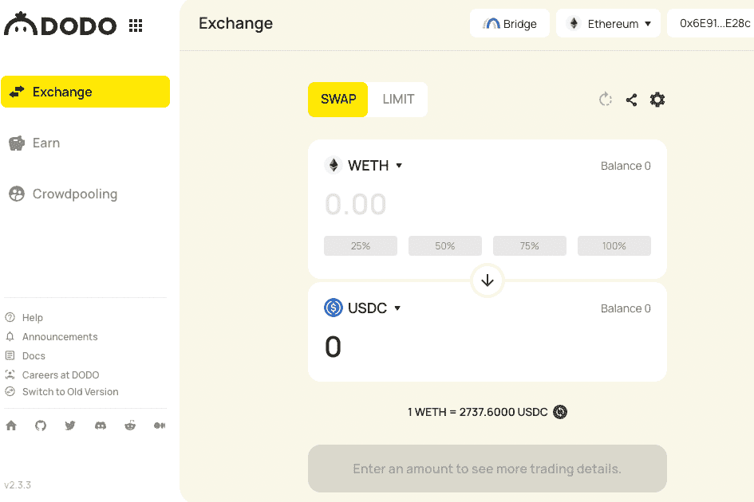

---
title: "DODO"
description: "DODO 是一个由主动做市商 (PMM) 算法提供支持的去中心化交易平台。"
date: 2022-08-16T00:00:00+08:00
lastmod: 2022-08-16T00:00:00+08:00
draft: false
authors: ["boogArno"]
featuredImage: "dodo-1.png"
tags: ["Exchanges","DODO"]
categories: ["nfts"]
nfts: ["Exchanges"]
blockchain: ""
website: "https://app.dodoex.io/"
twitter: "https://twitter.com/BreederDodo"
discord: "http://discord.gg/tyKReUK"
telegram: "https://t.me/dodoex_official"
github: "https://github.com/DODOEX"
youtube: "https://www.youtube.com/channel/UCTKBdYNFNAUkQADJVpan-_Q/videos"
twitch: ""
facebook: ""
instagram: ""
reddit: "https://www.reddit.com/r/DodoEx/"
medium: "https://blog.dodoex.io/"
steam: ""
gitbook: ""
googleplay: ""
appstore: ""
status: "Live"
weight: 
lightgallery: true
toc: true
pinned: false
recommend: false
recommend1: false
---
DODO 是一个由主动做市商 (PMM) 算法提供支持的去中心化交易平台。该平台具有高度资本效率的流动性池，使用以太坊钱包链接 DODO ，点击“挖矿-交易挖矿“，打开”挖矿模式“，返回交易界面，完成任意一笔链上交易即算参与。支持单一代币提供，减少无常损失，并最大限度地减少交易者的滑点。 DODO 为发行新资产消除了阻碍创建流动性池的所有障碍——资产比率、流动性深度、费率和其他参数都可以自由定制和实时配置。在 https://app.dodoex.io 了解更多信息

