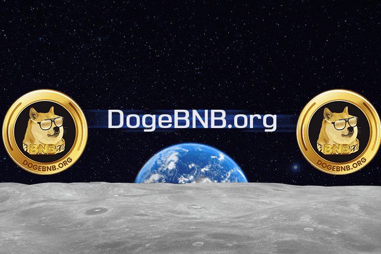

DogeBNB 代币 ($DogeBNB) 是一种由币安智能链提供支持的 meme 货币。 DogeBNB 为大众带来币安智能链的好处和创新。
在 Julpad 的首次 Dex 发行期间，70% 的供应分配给了社区。
公平发射证明：
创新：

  币安智能链
  点对点
  通过远分布模型分布
  社区驱动
  以 NFT-s 为后盾
  全球和超快速支付
  交易成本 ~ 0,1$

向前推进 DogeBNB 生态系统的目标变得完全去中心化。

