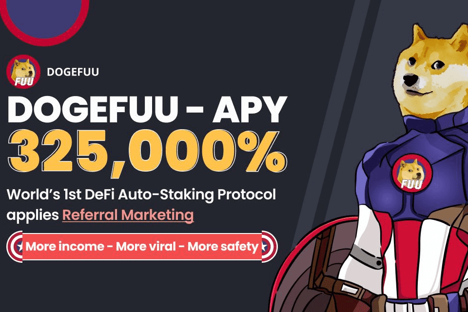

狗风
第一个 DeFi 自动质押协议应用推荐营销，APY 325,000%
更多收入 - 更多病毒 - 更多安全
DOGEFUU的亮点
高固定 APY 325,000% & 每 20 分钟获利
反倾销机制：确保您的投资安全。一天最多只能卖出 3% $DOGEFUU
推荐营销：病毒式传播并以高达 20% 的推荐奖金吸引新投资者
销售税 - 节省反思
安全性：无团队代币，100%代币锁定
Dogefuu 保险基金 (DIF)：避免闪崩并确保长期可持续性

