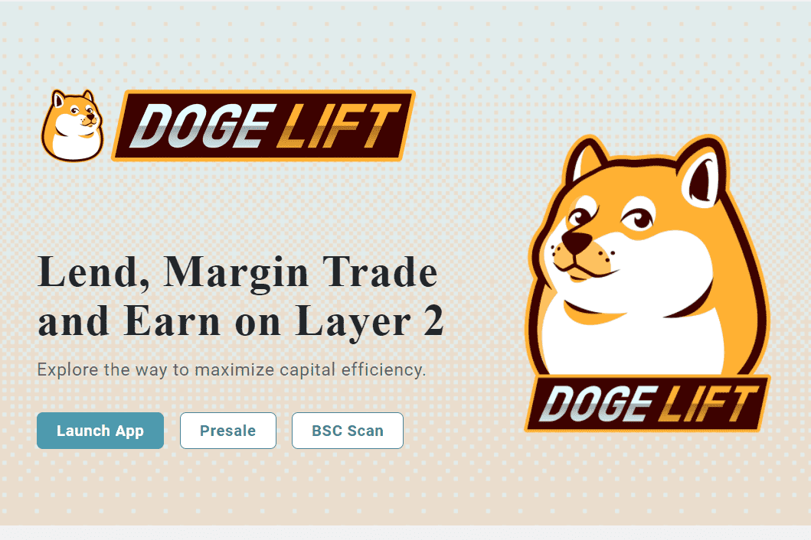

杠杆作用
流动性由经纪人或 Layer2 上的其他现有流动性协议提供。我们从币安创新区获取流动性，让用户体验媲美币安、Gate、Hotbit上的CEX。DOGE LIFT 象征着您作为 Amy Finance 早期贡献者的身份。所有 DOGE LIFT 拥有者将优先获得更多金猫空投用于 IQ MiningDOGELIFT 代币将于 2021 年 12 月 13 日出现在 Pancakeswap 交易所。

