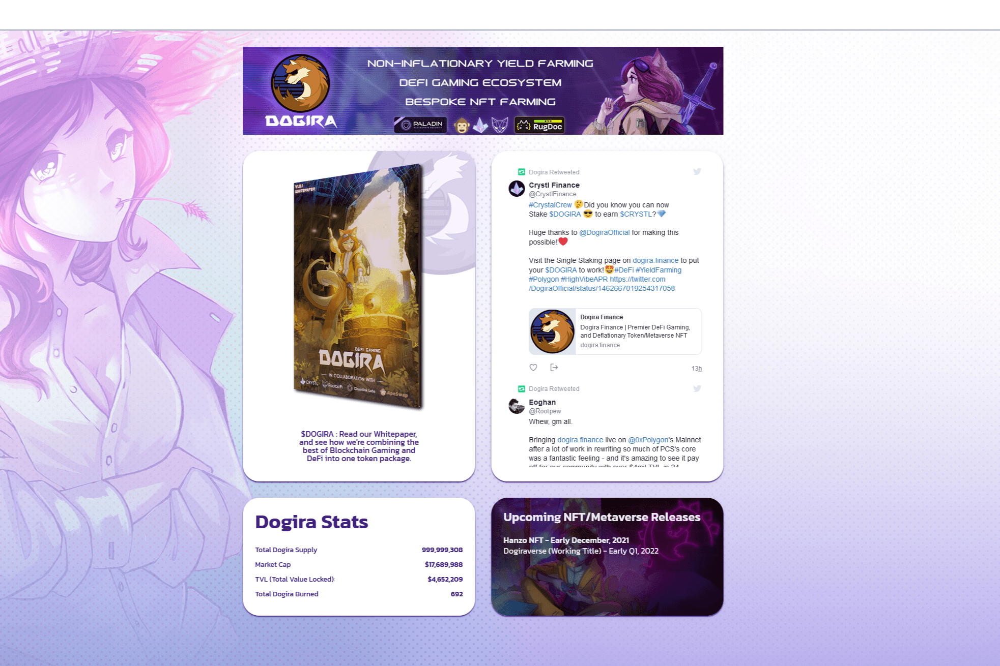

---
title: "Dogira Finance"
description: "非通胀收益农业、DeFi 游戏生态系统、定制 NFT 农业"
date: 2022-08-17T00:00:00+08:00
lastmod: 2022-08-17T00:00:00+08:00
draft: false
authors: ["boogArno"]
featuredImage: "dogira-finance.png"
tags: ["DeFi","Dogira Finance"]
categories: ["nfts"]
nfts: ["DeFi"]
blockchain: "Polygon"
website: "https://dogira.finance/"
twitter: "https://twitter.com/DogiraOfficial"
discord: "https://discord.gg/7MWZkJBX6r"
telegram: "https://t.me/dogiratoken"
github: ""
youtube: "https://www.youtube.com/channel/UCr4ISHT-C2LHczWc8anL9_g"
twitch: ""
facebook: ""
instagram: "https://www.instagram.com/dogiraofficial/?hl=en"
reddit: "https://www.reddit.com/r/Dogira/"
medium: "https://dogira-team.medium.com/"
steam: ""
gitbook: ""
googleplay: ""
appstore: ""
status: "Live"
weight: 
lightgallery: true
toc: true
pinned: false
recommend: false
recommend1: false
---
游戏不需要赶上区块链；区块链需要赶上游戏。
Dogira 已被开发为“黄金标准”游戏代币；允许持有者接触新兴的游戏工作室和 DeFi 平台，而无需面对通胀供应进行交易的风险，也无需检查复杂的游戏内经济。
Dogira 游戏生态系统将托管来自独立开发者、游戏工作室和加密项目的游戏。 Dogira Studios 将创造自己的游戏体验，同时通过使用区块链技术为游戏开发者赋能。

