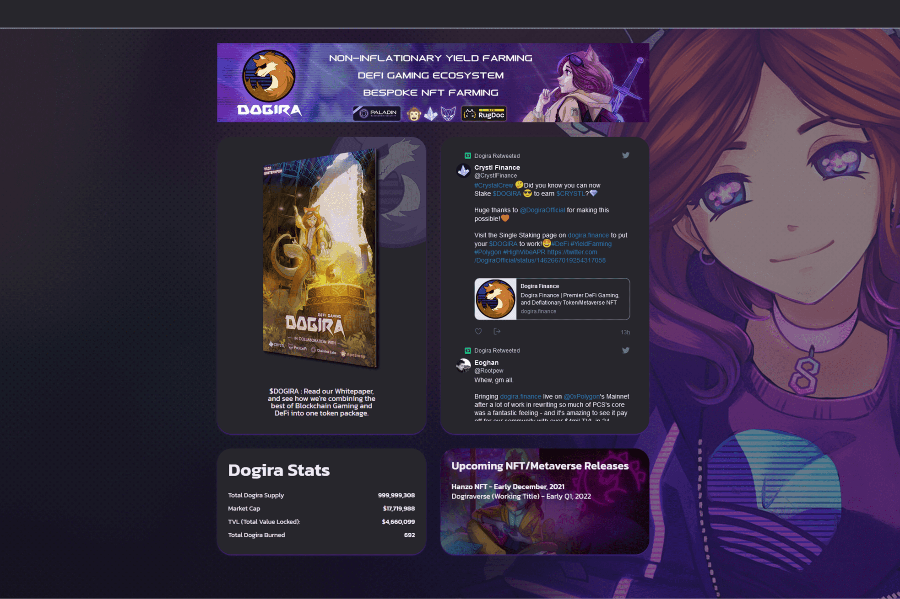

$DOGIRA 将去中心化金融和游戏的优点结合到一个代币包中；提供非通货膨胀的收益农业激励，直接支持我们内部工作室在 Polygon 网络上开发的游戏和 NFT 生态系统。Dogira Finance 是我们独特的非通胀质押平台，使用 PancakeSwap 的分叉基础构建，并经过修改以包含我们的定制合约和功能。

经 RugDoc.io 审查并由 Paladin Blockchain Security 全面审核，用户安全在我们的整个开发周期中始终是最重要的，确保我们在可访问性和交易安全性方面的标准得到最大程度的维护。

除了我们为单边质押和流动性挖矿定制的质押合约外，Dogira Finance 还利用我们自己的定制链上定价工具和 NFT 工具包集成。

