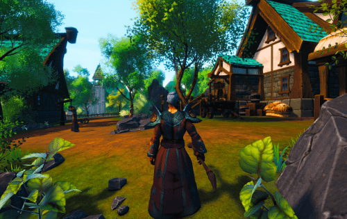

Domi Online 是一款赚取 NFT 支持的 3D 区块链 MMORPG 游戏。
我们组建了一支由业内最优秀的团队组成的团队，我们的首席开发人员来自世界上最大的免费 MMORPG “Runescape”，来自 ChainGuardians 的区块链专家（利用 NFT 游戏赚钱的真正先驱），以及 PelleK 的声音和 SFX （英雄联盟、万智牌、超凡战队、流放之路、朱红之王等）。在开放社交或向全世界分享有关 Domi 的新闻之前，我们已经在阴影中开发了几个月的游戏，因此我们与我们的社区一起开始了这段旅程，拥有一个完整的游戏设计、完整的团队和一个工作、漂亮和功能游戏。

