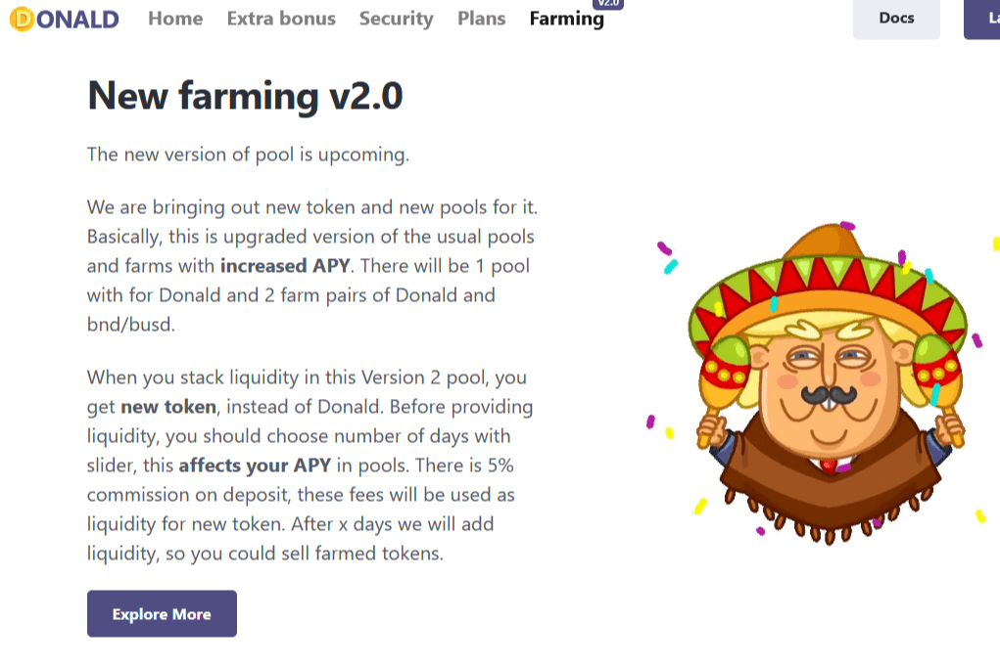

---
title: "Donald Finance"
description: "Donald Finance 是一个运行在币安智能链和 Pancake 交易所上的去中心化交易所，具有一些独特的功能和机制。"
date: 2022-08-17T00:00:00+08:00
lastmod: 2022-08-17T00:00:00+08:00
draft: false
authors: ["boogArno"]
featuredImage: "donald-finance.png"
tags: ["DeFi","Donald Finance"]
categories: ["nfts"]
nfts: ["DeFi"]
blockchain: "BSC"
website: "https://donald.finance/"
twitter: "https://twitter.com/donaldfinance"
discord: ""
telegram: "https://t.me/donald_finance_chat"
github: "https://github.com/donaldfinance"
youtube: ""
twitch: ""
facebook: ""
instagram: ""
reddit: ""
medium: ""
steam: ""
gitbook: ""
googleplay: ""
appstore: ""
status: "Live"
weight: 
lightgallery: true
toc: true
pinned: false
recommend: false
recommend1: false
---
什么是唐纳德金融？
具有所有基本去中心化金融功能的独特设计，但具有一些额外功能。除了简单的燃烧机制，我们还提供基于我们的代币的独特游戏。第一场比赛将是——唐纳德撞车。在我们的项目中，如果您是天使投资人，您可以获得奖金奖励。此外，我们还提供第 2 版农业。您可以在预售时购买我们的代币或通过空投获得它们。

