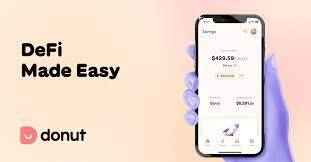

DonutDeFi 是一种新的综合 DeFi 协议，允许轻松交换代币、农业机会和游戏。实施最高安全标准，这是在币安智能链上获得回报的一种有趣且安全的方式。当您使用 Donut 进行储蓄时，我们会自动将您的美元转换为数字美元（稳定币，例如 USDC），以便我们可以将这些美元用于去中心化市场。我们的合作伙伴通过全球分散的借款人池以高利率借出您的美元。我们使用高度抵押的平台并与[Wyre](https://www.sendwyre.com/)和 [Yearn](https://yearn.finance/)合作，以确保您的资金安全。您可以赚取固定的 5% APY，根据您的策略上升到 10%。观看您的钱在应用程序中的实时增长 - 它全天候 24/7 赚钱。

