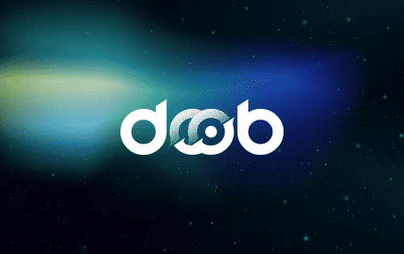

什么是 DoobDAO？
一种新的、定义类别的资产类别，允许聪明的投资者通过对冲来积累财富。它是币安智能链上一种分散的国库支持货币，价值至少保持在 1 美元。但是，DOOBDAO 不与任何事物挂钩，因此其价值可能超过 1 美元，为其持有者提供了巨大的上涨潜力。
DOOBDAO为什么存在？
DoobDAO 是 OHM 的一个分支，但对于那些错过 OHM 并正在寻找新机会的人来说，它具有全新的开始和低市值。
斗道是如何运作的？
它是一种由多资产稳定币支持的货币。它是一种货币，其国库和储备受协议控制。它是一种由社区管理的协议驱动的货币。
在高层次上，DoobDAO 由其协议管理的资金库、协议拥有的流动性、债券机制和旨在控制供应扩张的高质押奖励组成。
债券为协议产生利润，财政部使用利润来铸造 DOOBDAO 并将其分配给质押者。通过 LP 债券，该协议能够积累流动性以确保系统稳定性。

