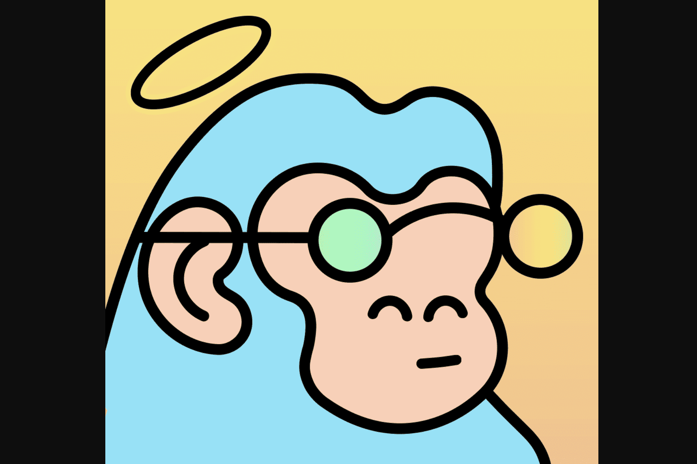

Doodle Kongz 是一个 NFT 项目，灵感来自著名的 Doodles 和 CyberKongz。 Doodle Kongz，又名 Dongz，具有作为灵感的项目中的流行特征。有许多不同的表情、帽子、配饰和背景，有许多独特的东兹一定会脱颖而出。 Genesis和Baby Dongz都具有可区分的特征和特征来区分两者。
在该项目中，有两个系列：Genesis Dongz 和 Baby Dongz。随着针对这些类型的 Dongz 的实用程序计划的实施，目前 Genesis Dongz 作为婴儿的白名单。

