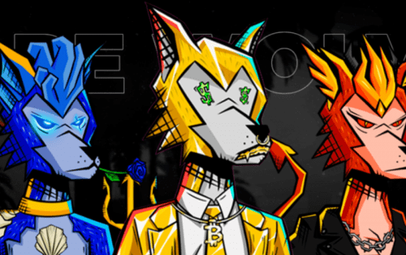

Dope Wolves 是 Oasis Network 上的第一个 Wolves NFT 系列，具有原创、独家和手绘设计。我们的艺术家创造了 161 种资产，并将它们与 10 个特征配对。在该系列中，所有资产都按稀有度进行排名。我们的艺术家和 Dope Wolves 团队彻底检查了质量。Dope Wolves是8888个独特的化身（前444个狼，将属于GEN1，其他的4444个，属于GEN2)资产按稀有度排名，每一个资产都是手绘的，我们的艺术家会仔细检查质量。

