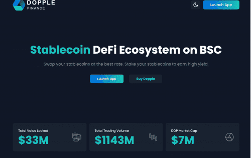

Dopple 是稳定币 DEX，专为在币安智能链上高效交换稳定币而设计。 Dopple 的原生代币 DOPX 用于铸造 Dopple 的分数算法稳定币 KUSD。可用的稳定币池：KUSD、BUSD、USDT、DAI、USDC、USDN、TUSD、DOLLY 和 UST。

协议 稳定币互换算法 专为在币安智能链上高效交易稳定币和锚定资产而设计。以最优惠的价格交换您的稳定币。质押您的稳定币以获得高收益。

