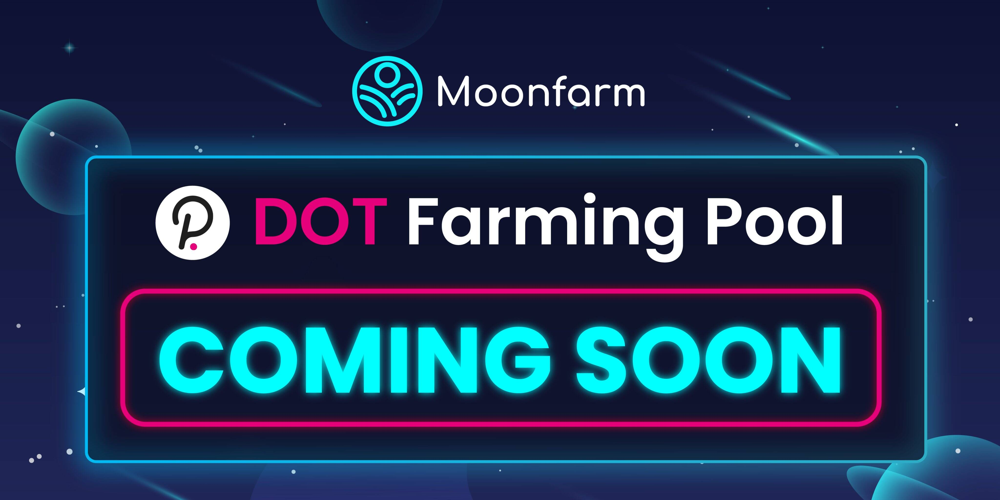

什么是 DOTMoonFarm？
能源 自动做市商 (AMM) 是一种协议，为所有可用的去中心化交易所 (DEX) 提供动力。 AMM 是一种自主交易机制，它消除了中心化交易所 (CEX) 的存在。
1. DOT Staking 最高可赚取 600%

2. 每 200 天从矿池中获得高达 600% 的利润

3. 从我们的推荐计划中获得 3% 的奖励

4. 在彩票和 FOMO 游戏中投注并获胜

   