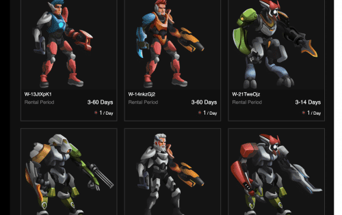

Double Protocol 是一个 NFT 租赁平台，主要用于 GameFi 和元界资产。利用Double提出的Dual Role NFT标准EIP-4907，可以轻松实现所有权和使用权的分离，极大地扩展了GameFi和元界的用户基础。Double Protocol 是一个完全去中心化和开源的 NFT 租赁协议和 Metaverse 和 GameFi 资产的市场。降低用户进入门槛
通过租赁降低用户参与项目的成本并扩大潜在用户群
增加持有人的收入
让您的 NFT 持有者获得租金收入，增强项目经济的稳定性
行业认可的标准
EIP-4907 和 EIP-5006 分别完全兼容 EIP-721 和 EIP-1155 租赁 NFT 标准

