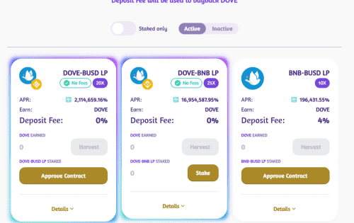

DoveSwap Finance 是具有通缩治理令牌模型的下一代自动做市 (AMM) 去中心化交易所。我们是您在币安智能链和 Pancakeswap 交易所上运行的首选收益农场，还有许多其他功能可以让您赚取代币。
与当前第二代单产农场的浪潮一样，其目的是创建一个具有持续燃烧机制的永久通缩代币 DOVE，以创造一个可以维持长期收益和持续高 APR 以获得更大收益的环境。

DoveSwap Finance 是币安智能链上一个社区驱动的去中心化交易所和收益农场平台。您可以通过将 DOVESWAP TOKEN 质押在池中并通过提供流动性来赚取更多 DOVESWAP 来赚取 DOVESWAP 代币。

