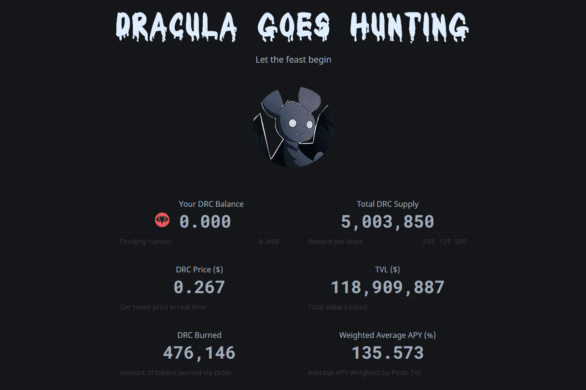

---
title: "Dracula Protocol"
description: "一种耕作一切的工具。 $刚果民主共和国"
date: 2022-08-17T00:00:00+08:00
lastmod: 2022-08-17T00:00:00+08:00
draft: false
authors: ["boogArno"]
featuredImage: "dracula-protocol.png"
tags: ["DeFi","Dracula Protocol"]
categories: ["nfts"]
nfts: ["DeFi"]
blockchain: "ETH"
website: "https://dracula.sucks"
twitter: "https://twitter.com/DraculaProtocol"
discord: "https://discord.com/invite/7JgByFU"
telegram: "https://t.me/DraculaProtocol"
github: "https://github.com/Dracula-Protocol"
youtube: ""
twitch: ""
facebook: ""
instagram: ""
reddit: ""
medium: "https://medium.com/@DraculaProtocol"
steam: ""
gitbook: ""
googleplay: ""
appstore: ""
status: "Live"
weight: 
lightgallery: true
toc: true
pinned: false
recommend: false
recommend1: false
---
DeFi 生态系统近年来发展了很多。收益农业和流动性挖矿已成为黄金标准。但是，它通常与因通货膨胀和代币抵押不足而导致长期失败的巨大风险相关联。
在 Dracula 协议中实施的元级吸血鬼概念可提供更高的利润，同时降低这些风险。它通过在一个智能合约和统一的 Web 界面下聚合所有收益农场和流动性挖掘来实现这一点。我们相信我们的解决方案将有助于 DeFi 生态系统的稳定性。