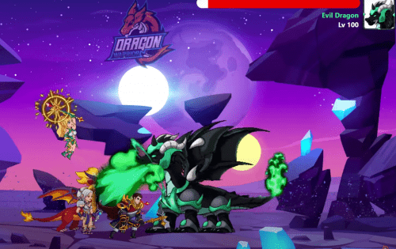

Dragon Warrior 游戏的灵感来自“如何训练你的龙”系列。通过游戏环境，我们想向您讲述 DRAGON 岛人民与龙之间寻求和平的激动人心的战斗。故事开始于多年前的龙岛，人与龙和平共处。当一个名叫所罗门的黑巫师带着他的三条恶龙来毒害岛上的龙时，问题就出现了。龙变得凶猛，袭击了岛上的人们。人们必须反击并找到摧毁所罗门的方法。在战争中，战士们决心找到治愈方法并成功了。药水只能用被打败的巨龙之血制成。药水制作成功后，武士就可以用它们驯服巨龙了。然后，他们将在即将到来的战斗中站在战士的身边。玩家将扮演战士的角色参加激烈的战斗，击败所罗门为岛上带来和平

