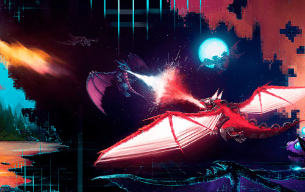

Dragonereum 是一款加密收藏游戏，用户可以在其中拥有一条龙、交易他们的龙、杂交它们并与其他龙作战，并在此过程中收集奖励和成就。所有这些都是在区块链上以开放、可信和去中心化的方式完成的。区块链和龙的数字稀缺游戏。从2018年开始生活

Dragonereum 建立在以太坊区块链之上，是一款具有 PvP 战斗、高级育种、游戏内交易、奖励和成就的加密收藏游戏。你可以完全控制你的龙的命运。你会统治天空吗？

