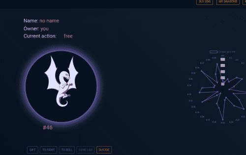

---
title: "dragoneth"
description: "在这里，你可以用以太币购买龙"
date: 2022-08-17T00:00:00+08:00
lastmod: 2022-08-17T00:00:00+08:00
draft: false
authors: ["boogArno"]
featuredImage: "dragoneth.png"
tags: ["NFT Games","dragoneth"]
categories: ["nfts"]
nfts: ["NFT Games"]
blockchain: "ETH"
website: "https://dragoneth.com/"
twitter: "https://twitter.com/dragons_eth"
discord: "https://discord.gg/kHMxad4"
telegram: "tg://join?invite=DEnpkgr31xVjG4io-wmwLQ"
github: "https://github.com/DeepDragons"
youtube: ""
twitch: ""
facebook: "https://www.facebook.com/ethdragons"
instagram: ""
reddit: "https://www.reddit.com/r/DragonsEth/"
medium: ""
steam: ""
gitbook: ""
googleplay: ""
appstore: ""
status: "Live"
weight: 
lightgallery: true
toc: true
pinned: false
recommend: false
recommend1: false
---
基于以太坊智能合约的投资游戏。每个 Dragon 都是一个受区块链保护的 ERC-721 代币。你知道关于区块链的所有知识，所以，让我们不要再喂汤了。每个人都买鸡蛋。在 3 周内，您的龙从一个可以通过单次动作购买的蛋中孵化出来 - 只需安装 MetaMask 浏览器扩展程序。排放量仅为 100,000，因此越远，成本越高。如果您不知道什么是区块链，我们有坏消息要告诉您。现在是2019年，伙计。几年后，我们将用加密货币支付一杯咖啡，而你甚至还没有安装 MetaMask。

