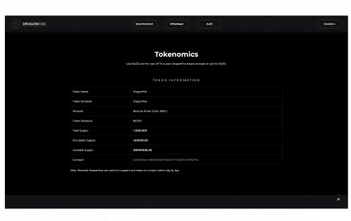

DragonFire 的一大新奇之处是 NFT。 NFT 在 DragonFire 中产生 6% 的被动收入。每个 NFT 都有一个类型和一种能力，专为未来 NFT 所有者之间的不同游戏和战斗而设计。此外，您将可以访问 DragonFire VIP 组，在那里您将能够与项目的所有者和管理员讨论，提出您自己的想法和对平台的改进。此外，DragonFire NFT 可以在币安智能链网络市场进行转售，代币价值越高，您的 NFT 将获得更多价值并产生更多利润。

