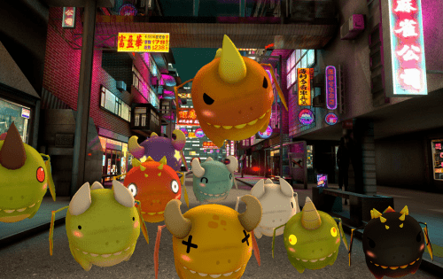

一种创新的 GameFi 代币，为 play2earn 平台提供奖励，允许在我们的平台上进行跨游戏集成和治理代币。
Dragons 合约部署在币安智能链上。玩家需要拥有一定数量的 $DRAGONS（游戏加密货币），才能在平台上支付资产。
他们将需要一个钱包（即 Metamask），设置到币安智能链网络，该网络可以存储 $DRAGONS，也可以使用它在游戏中买卖资产。
您运行的时间越长，而不会陷入障碍，保证玩家每天最少 100 个代币，最多 1000 个代币。
奖励会在 24 小时内自动分配给 nft 所有者。
Marketplace 具有随机铸币功能，让所有玩家都有相同的概率获得随机龙并在游戏中进化。
3D 游戏包含令人敬畏的龙系列、令人惊叹的关卡和街机动作。

