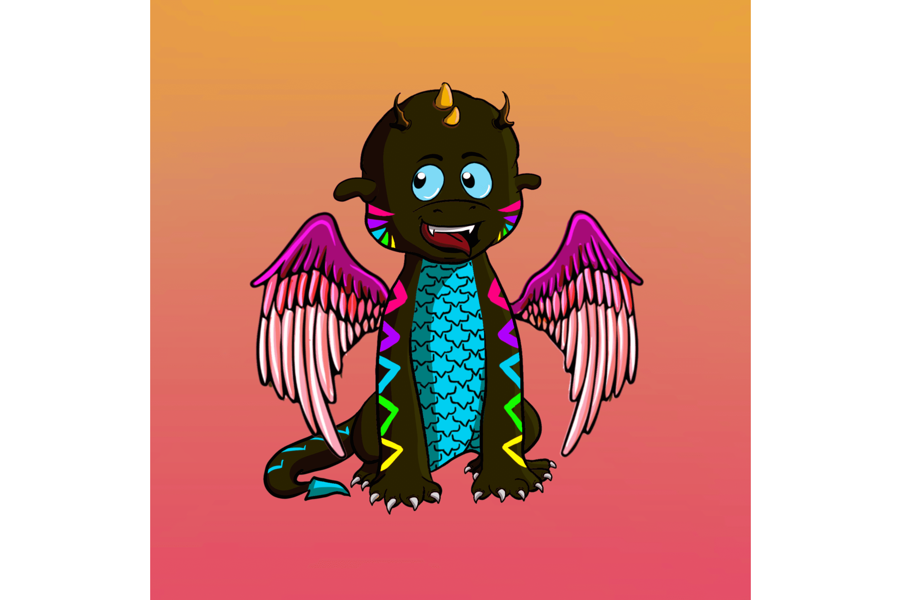

​				
​				Dragons Of Midgard，10,000 个独特的 Dragons NFT 在以太坊和 Solana 区块链上进化、变异和战斗。它基本上是一个 Play-To-Earn 游戏，玩家可以通过不同的战斗获得收益。玩家需要组建一支至少有 3 条龙的队伍才能进行战斗。玩家可以将他们的龙进化到一个新的水平，这将导致获得具有不同升级强度的新进化龙。玩家还可以通过培育龙来获得新的龙，既可以从自己的龙中获得，也可以与市场上的其他龙进行变异。我们的主要挑战是实现进化，因为我们相信任何区块链游戏项目都无法实现进化。
​						
​				

