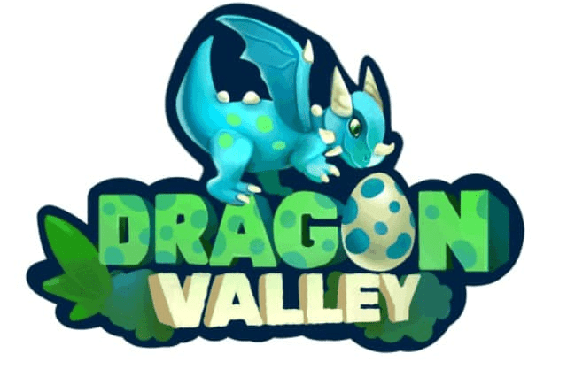

				HTML
				
					
				
				
						
				
			很长一段时间以来，人类一直认为龙是力量、智慧和神圣的象征。然而，尽管进行了多次努力，但仍无处可寻。然而，传说有一个地方，龙居住了几个世纪，叫做龙谷。在那里，龙与哥布林爆发了一场持续数百年的战争。为了结束这一切，龙神谕向最强大的龙战士之一 - 凯莉亚（长者）寻求帮助，并设法击败了哥布林国王卡拉西帕并将其置于魔法封印之下。三千年过去了，魔印的力量消退，将哥布林们放回了山谷。哥布林王和他的仆从计划再次入侵龙之国。成为一名优秀的驯龙师，进化你的龙，帮助打败妖精，让龙谷恢复平静，并从 Snag - Treasure Keeper 那里获得奖励。

