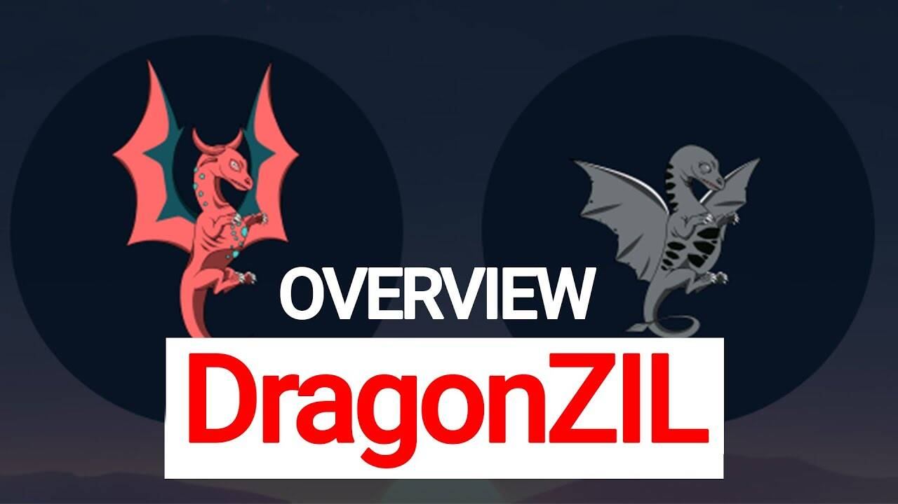

DragonZil 是一款 NFT、P2E、PVP、多人 GameFi，玩家在其中收集龙并使用它们进行无数行动以赚取收益、享受乐趣和收集。您可以使用这款带有 Dragon NFTS 的口袋妖怪风格游戏进行交易、变异、命名、燃烧、繁殖、战斗等等，DragonZIL是...
基于 Zilliqa 智能合约的投资游戏。每个 Dragon 都是一个受区块链保护的 ZRC1 代币。
什么是鸡蛋？
任何人都可以永远购买鸡蛋。您可以立即孵化它们或在 The Dragon Marketplace 上出售它们以获取利润

