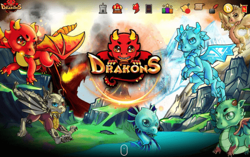

---
title: "Drakons"
description: "Drakons 是一款 DApp，可让您通过 DRAKONS NFT 进行游戏赚钱。"
date: 2022-08-17T00:00:00+08:00
lastmod: 2022-08-17T00:00:00+08:00
draft: false
authors: ["boogArno"]
featuredImage: "drakons.png"
tags: ["NFT Games","Drakons"]
categories: ["nfts"]
nfts: ["NFT Games"]
blockchain: "ETH"
website: "https://www.drakons.io/"
twitter: "https://twitter.com/DrakonsIO"
discord: "https://discord.gg/n9ZVQvv"
telegram: "https://t.me/DrakonsIO"
github: ""
youtube: "https://youtube.com/channel/UCx3ZC-3W1rlUo9944u_M-ZA"
twitch: ""
facebook: "https://www.facebook.com/Drakons.io/"
instagram: ""
reddit: ""
medium: "https://articles.drakons.io/"
steam: ""
gitbook: ""
googleplay: ""
appstore: ""
status: "Live"
weight: 
lightgallery: true
toc: true
pinned: false
recommend: false
recommend1: false
---
#BeADrakonMaster
一款 DApp 策略游戏，您可以在其中收集和玩以太坊区块链和多边形网络 (Matic) 侧链中称为 DRAKONS 的元素龙不可替代代币或 NFT。 Drakon Masters 将在 Drakon Arenas 享受战斗，有机会通过游戏赚取战利品、助推器和有价值的宝石，这些宝石可以兑换为 Drakon 的实用代币 Drakon 或 $DRK。Drakons.IO 是一个由区块链驱动的策略游戏和加密收藏品网站。Drakons 是基因独特、艺术设计的数字龙，被创建为加密收藏品。

根据他们的基本元素：空气、地球、火和水，或通过他们的元素宝石：蓝宝石、翡翠、红宝石和珍珠，购买和拥有 Drakons。

根据他们在敏捷、力量、智力和健康点方面的属性来收集它们。这些以及您的最佳策略将带您走向胜利并收集奖牌和球体。

培育或繁育这些龙兽，让位给几代迷人而强大的龙兽。

所以现在就收集并成为 Drakon 大师！

