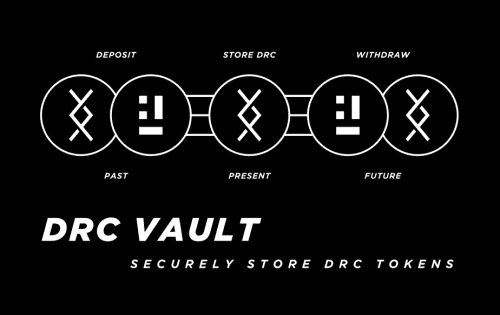

---
title: "DRC Vault"
description: "DRC Vault 是一个安全的非托管和 100% 去中心化的应用程序，专为 DRC 持有者创建，以安全地存储他们的 DRC 代币。"
date: 2022-08-17T00:00:00+08:00
lastmod: 2022-08-17T00:00:00+08:00
draft: false
authors: ["boogArno"]
featuredImage: "drc-vault.png"
tags: ["DeFi","DRC Vault"]
categories: ["nfts"]
nfts: ["DeFi"]
blockchain: "ETH"
website: "https://drcglobal.org/"
twitter: "https://twitter.com/DRCToken"
discord: "https://discord.gg/qDwAauW"
telegram: "https://t.me/DigitalReserveCurrency"
github: "https://github.com/digitalreserve"
youtube: "https://www.youtube.com/channel/UCXkqt2I6CYex3M74ojxgRmg"
twitch: ""
facebook: ""
instagram: ""
reddit: "https://www.reddit.com/r/DRCToken/"
medium: "https://medium.com/@digitalreservecurrency"
steam: ""
gitbook: ""
googleplay: ""
appstore: ""
status: "Live"
weight: 
lightgallery: true
toc: true
pinned: false
recommend: false
recommend1: false
---
DRC Vault 是专为 DRC 持有者创建的安全非托管和 100% 去中心化应用程序。在 DRC Vault 中持有的 DRC 代币完全由用户控制和拥有，其他任何人都无法访问这些资金。
DRC Vault 具有直观的界面，允许轻松存取款、排行榜和业绩统计。将来，DRC Vault 用户可能会获得额外的好处。DRC Vault 是专为 DRC 持有者创建的安全非托管和 100% 去中心化应用程序。在 DRC Vault 中持有的 DRC 代币完全由用户控制和拥有，其他任何人都无法访问这些资金。
DRC Vault 具有直观的界面，允许轻松存取款、排行榜和业绩统计。将来，DRC Vault 用户可能会获得额外的好处。

