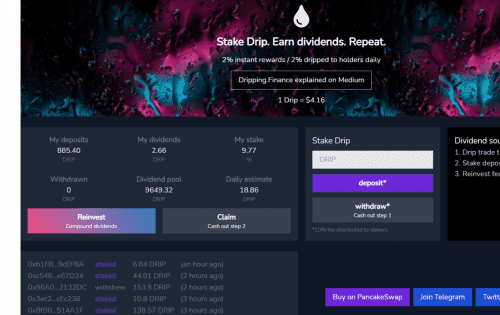

与 RFI 克隆或具有疯狂 APY 的农业项目不同，Dropping Finance 分红系统是为长期可持续性而建立的，奖励太容易发放，导致项目价值在一周内消失。我们做事不同。
我们能够通过利用多种股息（质押奖励）来源并将费用应用于质押和提款来激励质押者进行长期游戏。要准确了解其工作原理，请阅读我们上面的 Medium 文章。我们专注于为 Drip 代币的质押者提供带来被动收入的长期股息，而实现这一点的关键是奖励释放和多种股息来源之间的平衡。股息

