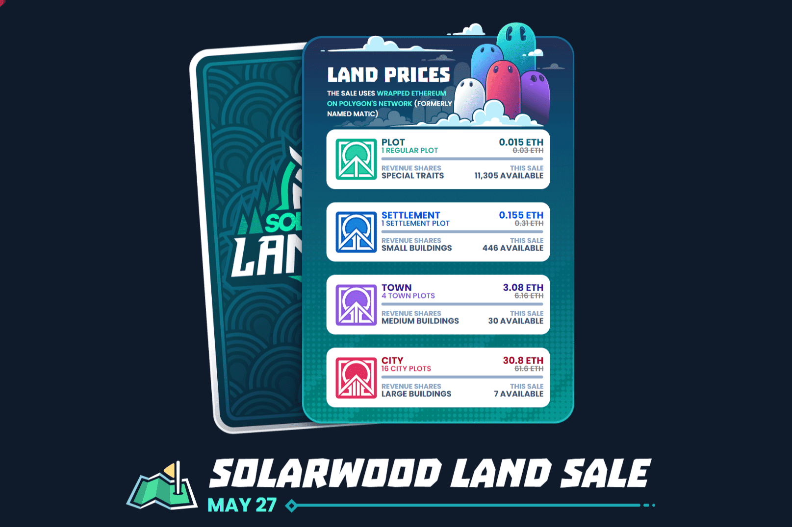

终极沙盒 MMORPG
在 Ember Sword 中，你做什么以及什么时候做完全取决于你！机械上强大且知识渊博将使您在Thanabus的月球上获得许多胜利。
有意义的最终游戏内容
Ember Sword 围绕“游戏性优先”的理念构建，将具有挑战性的 PVE 终局游戏、硬核 PvP、活生生的经济等等！
身临其境的故事情节
塔纳布斯有一个深刻的故事要讲。当你踏上这个月球时，你将面临严峻的挑战，遇到无情的角色，并结交新朋友。
专业和技能
Ember Sword 的进度基于将您的技能从 0 级提升到 100 级。每种武器类型都有自己的相关技能，其他 RPG 元素（如制作）也是如此。

