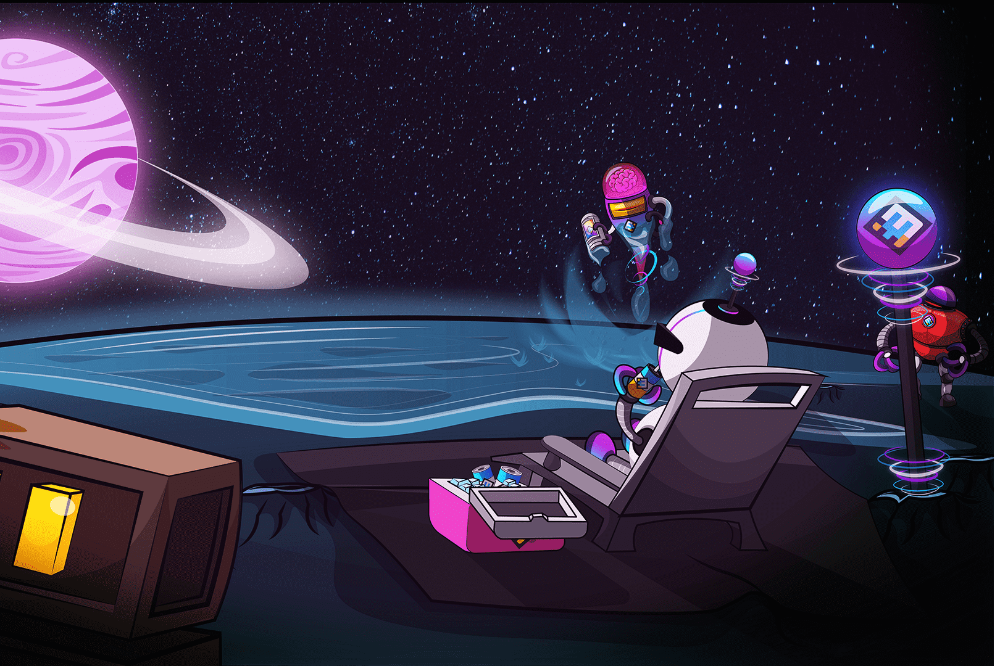

游戏发生在一个平行世界，其中有一个名为开普勒的星球，一个机器人大都市居住的地方。不幸的是，这并不全是和平。来自另一个星系的机器人攻击使地球几乎没有石墨烯，这是机器人日常生活的基本材料。因此，他们试图摧毁开普勒星球上的所有居民，包括在他们的计划中摧毁开普勒的大黑市，该黑市为该星球提供了异常数量的石墨烯。然而，并不是所有的希望都破灭了，随着机器人居民的力量，战斗变得激烈而持久，开普勒星球遭受了数十年的战争。新一代机器人已成为不知疲倦的战士和士兵，一切都是为了保护家园免受入侵者的侵害。

