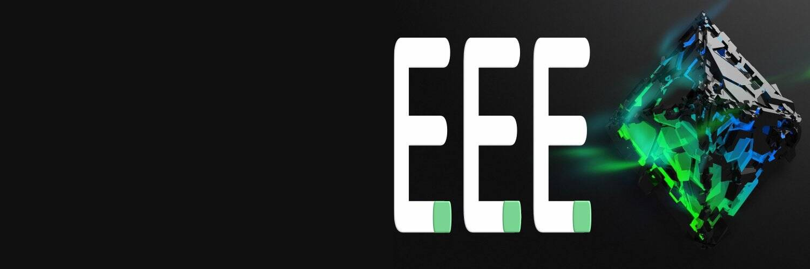

节能以太坊 (EEE) 是一种智能代币，可满足对气候友好型加密采矿的需求。我们与 Oairo 合作，这是一家获得专利且经过验证的空调技术提供商，可以将冷却计算机单元所需的功耗降低 70% 以上。
EEE 发行的收益将用于购买最节能的采矿装置并安装 Oairo 工厂和技术。生产的（节能）以太坊反过来将为全球 Oairo 项目的安装融资提供源头资金。该计划的目标之一是测试和生产“EEE 协议”，该协议将为以最节能的方式开采以太坊设定最佳标准、技术和专有技术。
无论我们是 POW 还是 POS，我们都将永远是节能的以太坊

