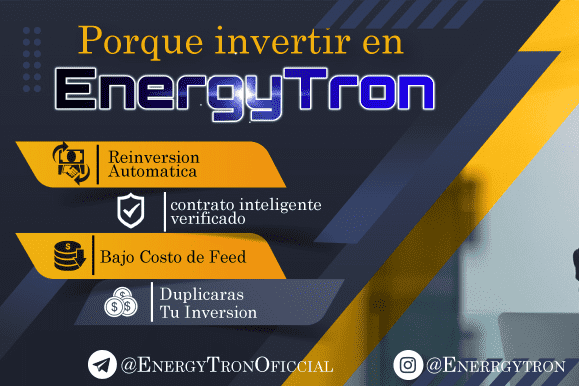

每天产生您的投资资本的4％...👌
✨利润高达200％（含）
提款时自动进行40％的再投资
36％的红利，用于3个等级分配的推荐
1级= 3％
⚡️等级2 = 2％
⚡️3级= 1％
✨神经性停药于每24小时一次。
✨我们是乘以tron来开始新的一年的最佳选择...🤯
✨最低投资额100trx✨
每次操作的Feed最高为7trx。
✨✨✨✨✨✨✨✨✨✨✨✨✨
🤔为减少运营商的电源，我们建议使用电源或从Tron 租借。
✨✨✨✨✨✨✨✨✨✨✨✨✨
️⚡️如何访问平台？ ⚡️✨
✨您可以从链接 tron，Klever 或 tron 钱包的 Dapp 浏览器中完成此操作，参考粘贴您的访问权限或智能链接。
ic⚡️linkoficial⚡️✨
（在这里，您将链接引用）
欲获得更多信息：

