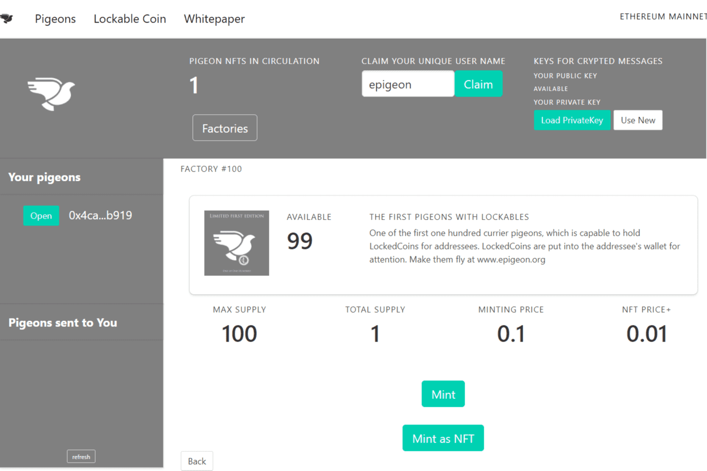

---
title: "Epigeon"
description: "有价值的消息"
date: 2022-08-16T00:00:00+08:00
lastmod: 2022-08-16T00:00:00+08:00
draft: false
authors: ["boogArno"]
featuredImage: "epigeon.png"
tags: ["Social","Epigeon"]
categories: ["nfts"]
nfts: ["Social"]
blockchain: ""
website: "https://www.epigeon.org/"
twitter: "https://twitter.com/team_epigeon"
discord: ""
telegram: ""
github: ""
youtube: ""
twitch: ""
facebook: "https://www.facebook.com/epigeon.org"
instagram: ""
reddit: ""
medium: ""
steam: ""
gitbook: ""
googleplay: ""
appstore: ""
status: "Live"
weight: 
lightgallery: true
toc: true
pinned: false
recommend: false
recommend1: false
---
您是否曾经想联系在区块链上拥有特定钱包地址的人？智能合约所有者，还是 NFT 持有者？您是否正在寻找用于消息传递的完全去中心化加密解决方案？
现在，您可以使用 Epigeon 的信鸽发送消息。每个拥有钱包地址的人都已经是用户，可以与我们联系。
鸽子将作为 NFT 拥有，也可以进行交易。鸽子可以保持接收者的注意力。
我们如何引起钱包所有者的注意？可锁定代币可以在消息传递期间为接收者的钱包锁定。通过锁定 Lockables，LockedCoins 将出现在收件人的钱包中。 LockedCoins 只能由接收者使用收到的消息解锁，以保护要阅读的消息。