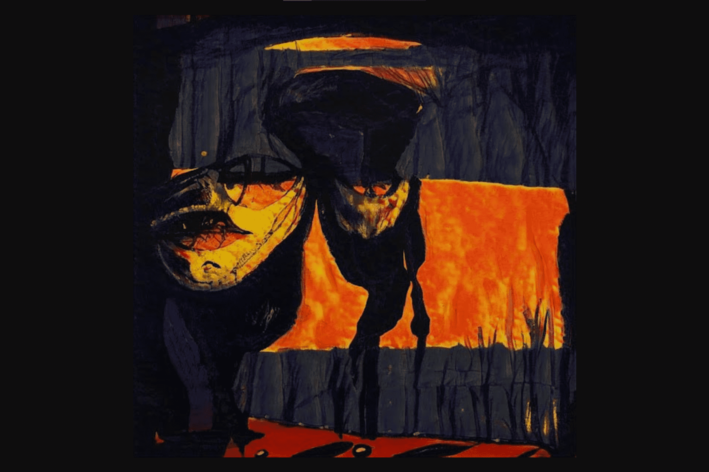

---
title: "Eponym by ART AI"
description: "第一个系列的所有 10k 都已铸造！请继续关注每个生成的图像中隐藏的稀有属性的更新..."
date: 2022-08-16T00:00:00+08:00
lastmod: 2022-08-16T00:00:00+08:00
draft: false
authors: ["boogArno"]
featuredImage: "eponym-by-art-ai.png"
tags: ["Collectibles","Eponym by ART AI"]
categories: ["nfts"]
nfts: ["Collectibles"]
blockchain: "ETH"
website: "https://art-ai.com/"
twitter: "https://twitter.com/EponymNFT"
discord: "https://discord.com/invite/EponymNFT"
telegram: ""
github: ""
youtube: ""
twitch: ""
facebook: ""
instagram: ""
reddit: ""
medium: ""
steam: ""
gitbook: ""
googleplay: ""
appstore: ""
status: "Live"
weight: 
lightgallery: true
toc: true
pinned: false
recommend: false
recommend1: false
---
Eponym 是一种最先进的生成算法，使用创新的文本到图像生成器，可在 1 分钟内生成精美的抽象艺术。任何单词或短语，都可以转化为精美的 1/1 艺术作品，永远蚀刻在以太坊区块链上，作为您短语的视觉表示。该程序是由世界上最好的生成艺术工程师在过去 2 年中开发的。

