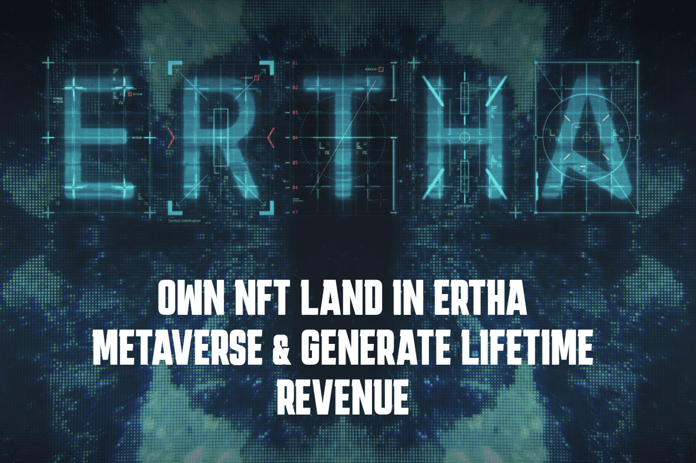

ERTHA metaverse 是《魔法门之英雄无敌》游戏类型启发的经济和社会生活模拟，建立在币安智能链上，用于探索和调查世界、升级和参与 NFT 市场——确保投资获得终身收入。
什么是厄莎？
真实世界的反映，玩家通过模拟日常生活表现来推动经济、战争和政治以增加利润。
Ertha 被分成 350,000 个 NFT 六边形，为土地所有者的每笔 ETH 交易产生现金返还。
网络使用智能合约允许用户拥有、交易、转让和升级数字土地。
建立在币安智能链上，第一款游戏。

