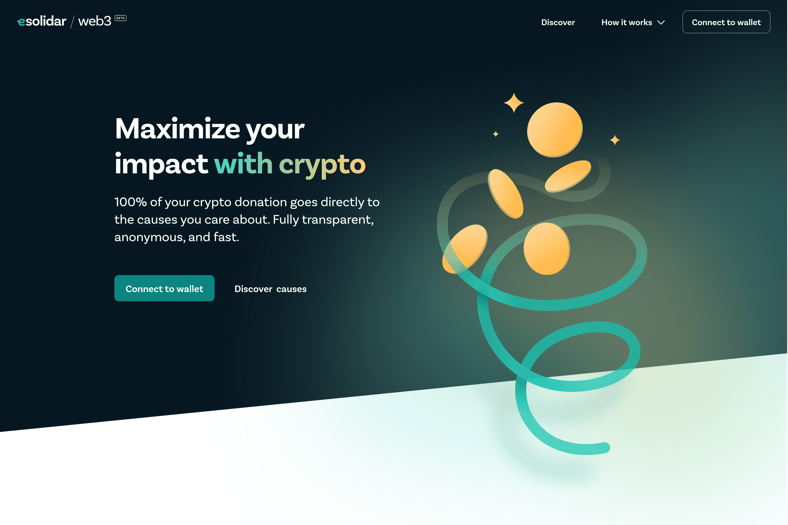

我们的团队一直致力于在慈善事业和加密爱好者之间架起一座桥梁，从 Celo 社区开始。
我们在 Celo 之上创建了一个专用的 Dapp，任何已经使用 esolidar 的非盈利、可持续项目或事业都可以选择上市并接收 Celo 稳定币作为捐赠 (cUSD)。筹款活动按 SDG（联合国可持续发展目标）分类，并可按地点搜索。在 Valora 或 MetaMask 中持有 cUSD 的全球捐助者可以选择任何金额来支持符合特定 SDG 或地点标准的筹款活动。