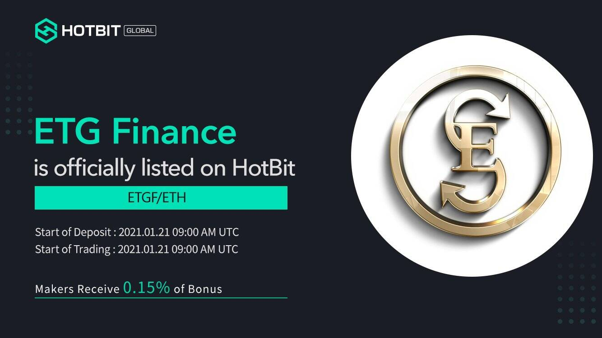

ETG Finance 是一个基于 ETGF 代币的 DeFi 生态系统，它包含：
E-Stake 质押在同一天启动，10 月 10 日预售。
Staking ETGF 在 10 月 24 日之前获得 84% APY，之后获得 36%。
E-Farm 在 uniswap 中提供流动性以获得 8% ETGF 奖励
社区用户的 E-Vote 链上投票。
E-Swap 类似于 Uniswap 交易所。
白皮书和网站中的更多信息。

