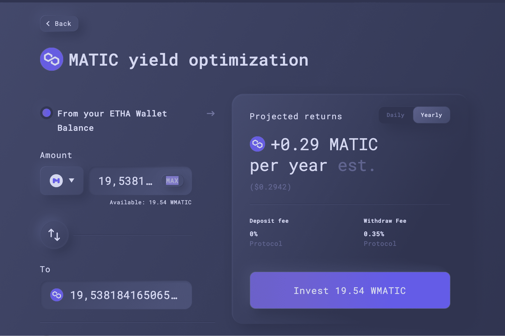

ETHA Lend 是一个基于以太坊和 Polygon 的可组合 DeFi 收益优化器。
该协议与多个 DeFi 生态系统交互，利用数据分析和优化技术向流动性提供者提供最佳收益，从而提供最佳收益。
ETHA 是实用代币，将用于：

  对协议的参数更改和升级进行投票
  质押以从绩效费中获得奖励
  用于流动性挖矿

EHA 协议包括：

  ETHA Discovery Algorithm 获取许多数据点，包括当前的 gas 成本，以提供最佳产量
  ETHA Pools 帮助 LP 提供稳定的资产，并允许他们从波动的资产中赚取收益。本金不受波动的影响，而收益是在波动的资产中获得的
  ETHA Lend 通过使用数据分析和优化技术提供算法最优产量

