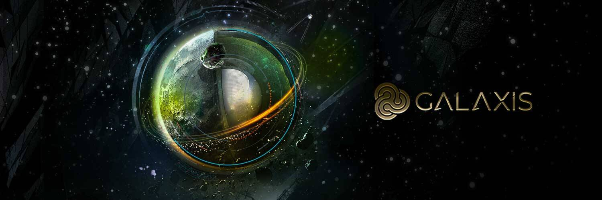

以太卡平台是一个社区驱动的 NFT 框架。它使创作者能够通过扩展 NFT 市场的能力来最大化其 NFT 艺术或系列的价值。它允许任何人为他们选择的任何 NFT 资产设置事件、谜题、赏金和其他十几种不同的实用程序。以太卡是一个完全集成的生态系统，由两个主要部分组成。这些是平台和以太卡（会员卡 NFT）。
以太卡是高级 NFT 会员卡，允许社区使用该平台及其功能并获得更多收益。尽管更广泛的公众仍然可以使用该平台，但只有 Ether Card 持有人才能获得额外的好处，例如获得免费服务、折扣、VIP 访问通行证、免费 NFT 掉落和其他特殊属性。

