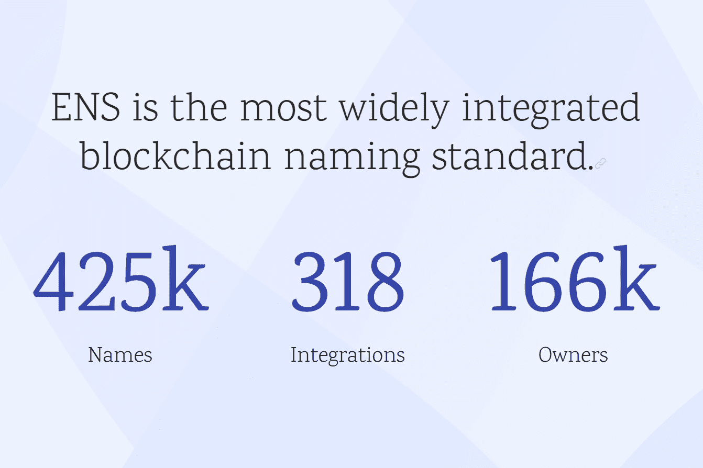

---
title: "Ethereum Name Service"
description: "您的 web3 用户名、所有加密地址的名称和去中心化网站。"
date: 2022-08-16T00:00:00+08:00
lastmod: 2022-08-16T00:00:00+08:00
draft: false
authors: ["boogArno"]
featuredImage: "ethereum-name-service.png"
tags: ["Other","Ethereum Name Service"]
categories: ["nfts"]
nfts: ["Other"]
blockchain: "ETH"
website: "https://ens.domains/"
twitter: "https://twitter.com/ensdomains"
discord: ""
telegram: ""
github: "https://github.com/ensdomains"
youtube: ""
twitch: ""
facebook: ""
instagram: ""
reddit: ""
medium: "https://medium.com/the-ethereum-name-service"
steam: ""
gitbook: ""
googleplay: ""
appstore: ""
status: "Live"
weight: 
lightgallery: true
toc: true
pinned: false
recommend: false
recommend1: false
---
以太坊名称服务（ENS）是一个基于以太坊区块链的分布式、开放和可扩展的命名系统。
ENS 的工作是将人类可读的名称（如“alice.eth”）映射到机器可读的标识符，如以太坊地址、其他加密货币地址、内容哈希和元数据。 ENS 还支持“反向解析”，从而可以将元数据（例如规范名称或接口描述）与以太坊地址相关联。
ENS 与互联网的域名服务 DNS 具有相似的目标，但由于以太坊区块链提供的功能和限制，其架构有很大不同。与 DNS 一样，ENS 在称为域的点分隔分层名称系统上运行，域的所有者可以完全控制子域。
顶级域，如“.eth”和“.test”，由称为注册商的智能合约拥有，注册商指定了管理其子域分配的规则。任何人都可以通过遵守这些注册商合同规定的规则，获得自己使用的域的所有权。 ENS 还支持导入用户已经拥有的 DNS 名称以在 ENS 上使用。

