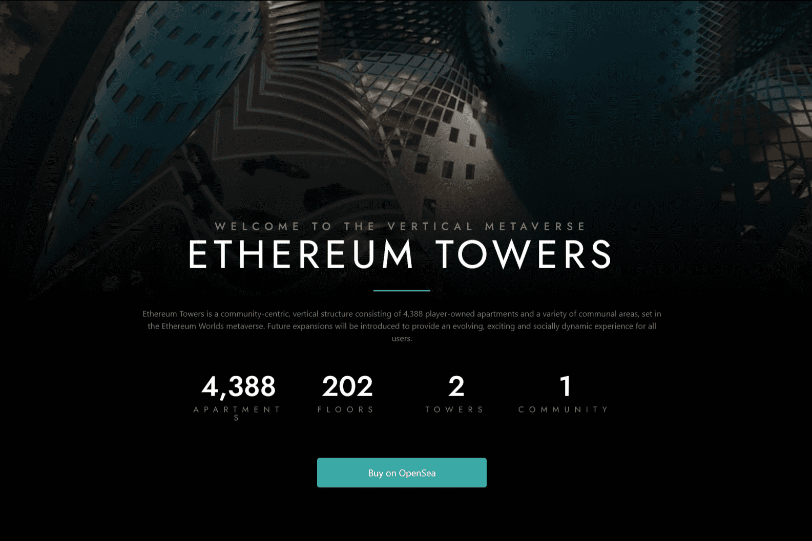

Ethereum Towers 是一个以社区为中心的垂直巨型结构，由 4,388 套居民拥有的公寓和各种公共区域组成，位于即将到来的 Ethereum Worlds Metaverse。
Ethereum Towers 由屡获殊荣的建筑师设计，将成为不断扩大的元宇宙中的旗舰住宅，将为所有居民和游客提供不断发展、令人兴奋和充满社会活力的体验。
由 2 座独立的概念塔楼组成...... Ethereum Towers 由 4,388 套公寓组成，每座塔楼的 101 层。每层由不超过 22 套公寓组成（标准、豪华和顶层公寓）。

